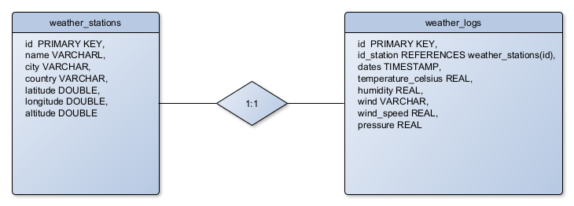

# Sistemas-de-Mensajes

## Overview

Este repositorio contiene un prototipo funcional de un Sistema de Gestión de Logs de Estaciones Meteorológicas implementado mediante una arquitectura de microservicios.

El objetivo principal es establecer un flujo de datos robusto, persistente y escalable para la ingesta, procesamiento, validación y almacenamiento de datos simulados de sensores meteorológicos. El diseño prioriza la durabilidad de los mensajes y la persistencia del estado utilizando contenedores Docker.

## Requerimientos

### Productores de datos (Producers)

Servicio en Python que simule o reciba datos de estaciones (JSON). Debe publicar a un exchange de RabbitMQ con mensajes durables.

### Consumidores (Consumers)

Microservicio en Python que:

    - Procesa los mensajes con *ack* manual.
    - Persiste en PostgreSQL (tabla `weather_logs`).
    - Valida rangos de valores y gestiona errores.

### Base de datos

Se plantea al siguiente esquema PostgreSQL para el almacenamiento de datos



---

## Instalación y configuración

### Requerimientos

- Python 3.9+
- Docker

### Configuración local

1. Clona el repositorio.
2. Ejecuta el comando: docker-compose up

Si se quieren correr los pocos pero efectivos tests que se han implementado:

1. Construye el test con el comando: docker-compose build tests

2. Corre los tests con el comando: docker-compose run --rm tests

# Monitoreo con Prometheus y Grafana

Luego de haber construido el docker y haberlo activado, se pueden usar prometheus y grafana para confirmar su funcionamiento.

## Descripción

El sistema expone métricas de Prometheus para monitorear:
- **Mensajes Publicados**: Contador de mensajes enviados a RabbitMQ por el producer
- **Mensajes Guardados**: Contador de mensajes exitosamente guardados en PostgreSQL por el consumer

## Acceso

### Prometheus
- **URL**: http://localhost:9090
- **Scraped targets**: 
  - consumer:8000 (consumer metrics)
  - producer:8001 (producer metrics)

### Grafana
- **URL**: http://localhost:3000
- **Usuario**: admin
- **Contraseña**: admin

## Métricas Disponibles

### Del Producer (puerto 8001)
- `messages_published_total`: Número total de mensajes publicados en RabbitMQ

### Del Consumer (puerto 8000)
- `messages_processed_total`: Número total de mensajes guardados en PostgreSQL

## Dashboard Incluido

El dashboard automático "Sistema de Mensajes - Monitoreo" incluye:

1. **Gráfico de líneas**: Mensajes publicados vs guardados (histórico)
2. **Tasa de mensajes**: Velocidad de procesamiento (mensajes/minuto)
3. **Gráfico de torta**: Proporción entre publicados vs guardados
4. **Estadísticas**: Total de mensajes publicados y guardados


### Soporte de Docker

Los entornos de desarrollo y despliegue se contenerizan mediante un `Dockerfile` personalizado, compatible con sistemas Linux. Este incluye todas las configuraciones y dependencias necesarias para una replicación consistente del entorno.

---

## Estructura

```
Sistemas-de-Mensajes
───docs
├───init
├───logs
├───monitoring
└───src
    └───app
        ├───logs
        ├───services
        │   ├───consumers_service
        │   │   └───utils
        │   └───producers_service
        └───tests
            ├───.pytest_cache
            │   └───v
            │       └───cache
            └───__pycache__
```

---

## Equipo

- **Mario Alberto Julio Wilches**
- **Alejandro Villareal Imitola**
- **Alejandro Pedro Steinman Cuesta**
- **Ana Sofia Meza**

---
